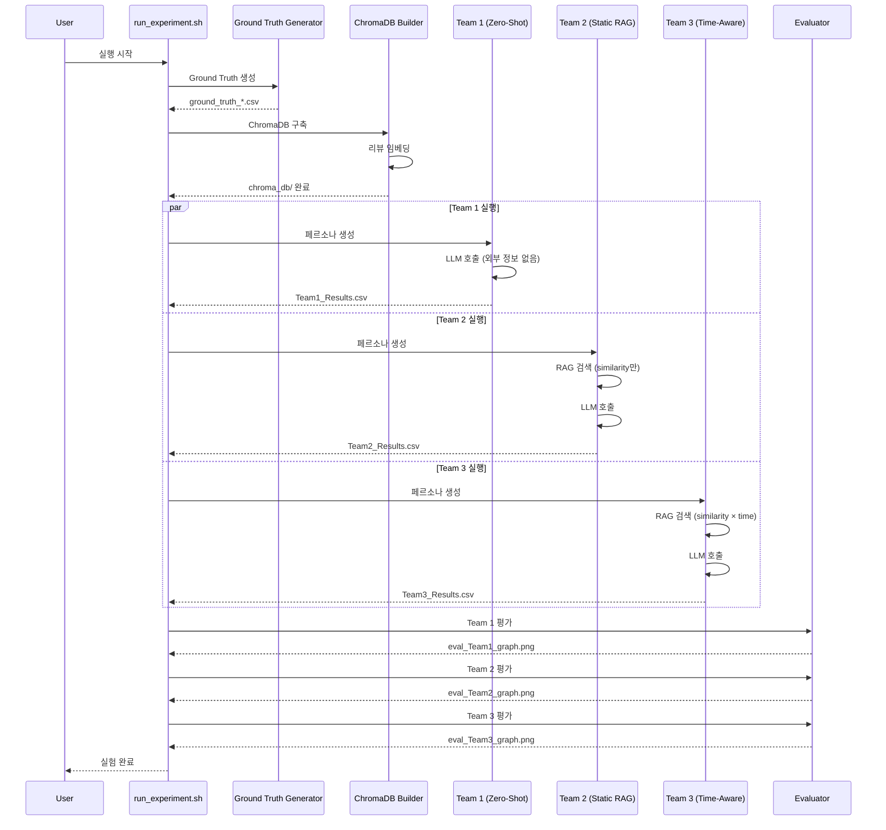
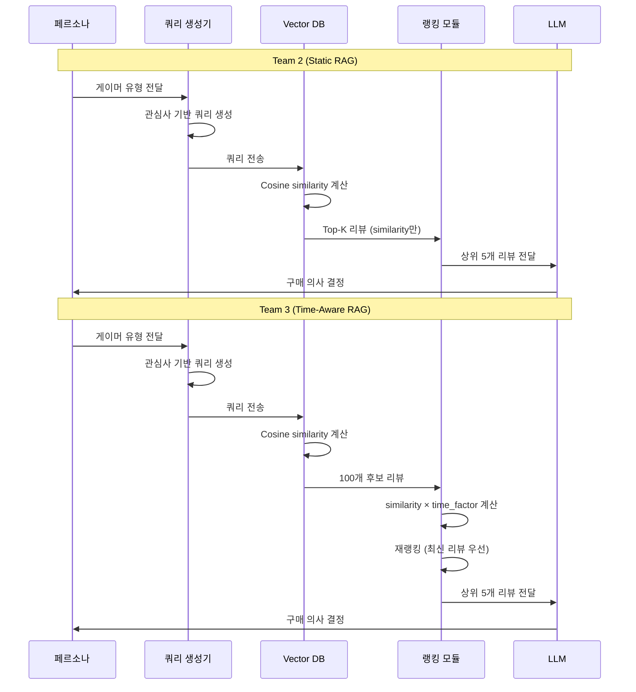

# 🎮 Cyberpunk 2077 Purchase Intent Simulation (Multi-Agent RAG)

이 프로젝트는 '사이버펑크 2077'의 출시 전후 여론 변화를 시뮬레이션하기 위해, **3가지 다른 방법론(Team 1, 2, 3)** 을 비교 분석합니다.
모든 팀은 공통된 평가 스크립트와 **공통 페르소나 모듈**을 사용하여 실험의 일관성을 유지합니다.

## 🚀 빠른 시작 (Quick Start)

```bash
# 1. 환경 설정
cp env_template.txt .env
# .env 파일을 열어서 OPENAI_API_KEY 입력

# 2. 전체 실험 실행 (가상환경 자동 생성 및 패키지 설치 포함)
chmod +x run_experiment.sh
./run_experiment.sh
```

**실험 소요 시간:** 약 1-2시간 (API rate limit에 따라 달라질 수 있음)

> **참고:** `run_experiment.sh`는 자동으로 가상환경(`.venv`)을 생성하고 필요한 패키지를 설치합니다.

---

## 🔬 실험 개요 (Experiment Overview)

> **💡 일반 데이터 분석과의 차별점:** 이 실험은 단순 통계 분석이 아닌, **에이전트 기반 시뮬레이션**을 통해 시간에 따른 동적 변화를 모델링합니다. 증빙 자료는 `experiment_validation/` 폴더를 참고하세요.

### Team 1: Static Zero-Shot
- **방법:** 페르소나만으로 예측 (RAG 없음)
- **특징:** 시간/리뷰 정보 없이 고정된 구매율
- **목적:** "아무것도 안 넣으면 이 정도"의 기준선

### Team 2: Static RAG
- **방법:** Cosine similarity 기반 RAG 검색
- **특징:** 시간 개념 없이 유사도만으로 리뷰 선택
- **목적:** Team 3와 비교의 기준선

### Team 3: Time-Aware RAG
- **방법:** Cosine similarity × Time decay 가중치
- **특징:** 최근 리뷰에 높은 가중치 부여
- **목적:** 시간 정보를 활용한 구매 의도 예측 개선

---

## 📊 실험 구성 요소 (Experimental Components)

### 실험 구성 요소 표

| 구성 요소 | Team 1 | Team 2 | Team 3 | 설명 |
|:---|:---|:---|:---|:---|
| **페르소나 생성** | ✅ | ✅ | ✅ | `utils/persona_generator.py` (104명, 동일) |
| **쿼리 생성** | ❌ | ✅ | ✅ | `utils/search_queries.py` (관심사 기반) |
| **RAG 검색** | ❌ | ✅ | ✅ | ChromaDB 벡터 검색 |
| **Time Decay** | ❌ | ❌ | ✅ | `exp(-decay_rate × days_diff)` |
| **LLM 모델** | ✅ | ✅ | ✅ | `gpt-4o-mini` (통일) |
| **Temperature** | ✅ | ✅ | ✅ | `0.5` (통일) |
| **외부 정보** | ❌ | ✅ | ✅ | Steam 리뷰 데이터 |
| **시간 변수** | ❌ | ✅ | ✅ | 시뮬레이션 날짜별 실행 |
| **예상 상관계수** | `NaN` | 낮음 | 높음 | Ground Truth와의 상관관계 |

### 실험 파이프라인 시퀀스 다이어그램



### Team 2 vs Team 3 RAG 프로세스 비교



---

## 🔑 Team 2와 Team 3의 핵심 차이점

### 동일한 부분 (공정성 보장)
- ✅ **페르소나 생성:** `utils/persona_generator.py` 공통 사용
- ✅ **쿼리 생성:** `utils/search_queries.py` 공통 사용 (관심사 기반 쿼리)
- ✅ **리뷰 임베딩:** 동일한 모델 (`all-MiniLM-L6-v2`)
- ✅ **ChromaDB 컬렉션:** 동일한 데이터베이스 사용
- ✅ **평가 기준:** 동일한 `evaluate_correlation.py` 사용

### 💡 관심사 기반 쿼리 생성 (Interest-Based Query)

**핵심 아이디어:** 페르소나별로 **"이 사람이 구글이나 유튜브에 뭐라고 검색할까?"**를 상상해서 쿼리를 만듭니다. 사용자가 실제로 궁금해할 만한 정보를 검색하는 것에서 실제 사람과의 유사성이 높아집니다!

**예시:**
- **Cloud Gamer**: `"Cyberpunk 2077 optimization bugs performance low fps"` (최적화/버그 검색)
- **Hardware Enthusiast**: `"Cyberpunk 2077 graphics ray tracing benchmark visuals"` (그래픽 검색)
- **All-Round Enthusiast**: `"Cyberpunk 2077 overall review pros and cons story gameplay"` (종합 리뷰 검색)

**작동 원리:**
1. **Agent:** "나는 `Cloud Gamer`야."
2. **Query Generator:** "그럼 너는 최적화가 중요하겠네? 쿼리는 `Cyberpunk 2077 optimization bugs`로 정할게."
3. **Vector DB:** 해당 쿼리와 유사한 리뷰들(예: *"최적화 개망함", "버그 때문에 튕김"*)을 찾아서 가져옴.
4. **LLM (Decision):** "나는 `Cloud Gamer`인데, 검색된 리뷰들이 다 최적화가 나쁘다고 하네? -> **구매 안 함(NO)**"

### 차이점 (오직 시간 가중치)
- **Team 2:**
  ```python
  # static_rag/rag_modules.py
  results = collection.query(
      query_texts=[query],
      n_results=top_k,  # 작은 풀에서 직접 선택
      where={"date": {"$lte": date_int}}
  )
  # similarity만 사용 (time weight 없음)
  ```

- **Team 3:**
  ```python
  # time_aware_rag/rag_modules.py
  results = collection.query(
      query_texts=[query],
      n_results=100,  # 넓은 풀 검색
      where={"timestamp": {"$lte": current_ts}}
  )
  # similarity × time_factor 계산
  similarity = max(0, 1 - dist)
  time_factor = np.exp(-decay_rate * days_diff)
  final_score = similarity * time_factor  # ← 핵심 차이
  ```

**결론:** Team 2와 Team 3의 차이는 **오직 시간 가중치(time decay) 적용 여부**입니다.

---

## ⏰ Time-Aware 가중치 구현

### 동기 (Motivation)
- **지연된 여론 반영:** 출시 초기 리뷰와 후기 리뷰의 신뢰도 차이
- **최신 정보 우선:** 최근 리뷰가 현재 게임 상태를 더 잘 반영

### 구현 (Implementation)
- **함수:** Exponential decay
  ```python
  time_factor = exp(-decay_rate * days_diff)
  final_score = similarity * time_factor
  ```
- **파라미터:** `decay_rate = 0.01` (기본값)
- **Half-life:** 약 70일 (70일 후 가중치가 절반으로 감소)

### 예시
- 0일 전 리뷰: `time_factor = 1.00` (100%)
- 70일 전 리뷰: `time_factor ≈ 0.50` (50%)
- 100일 전 리뷰: `time_factor ≈ 0.37` (37%)
- 200일 전 리뷰: `time_factor ≈ 0.14` (14%)

---

## 📝 최근 변경 사항 (2025-01-04)

### 실험 공정성 보장을 위한 통일 작업

**변경 이유:** 대조군(control group) 생성을 위해 모든 팀이 동일한 조건에서 실험하도록 통일

**주요 변경:**
1. **LLM 모델 통일**
   - 문제: Team 2는 `qwen3:4b`, Team 3는 `gpt-4o-mini` 사용 → 모델 차이로 인한 편향 가능
   - 해결: `utils/llm_config.py` 공통 모듈 생성, 모든 팀이 `gpt-4o-mini` 사용
   - 결과: 성능 차이는 오직 RAG 방식 차이만 반영

2. **Temperature 통일**
   - 문제: Team 1(0.7), Team 2/3(0.5) 서로 다른 값 사용
   - 해결: 모든 팀이 `0.5`로 통일

3. **API 키 처리 통일**
   - 문제: Team 2는 `.env`, Team 3는 `input()` 사용
   - 해결: 모든 팀이 `.env` 파일에서 로드하도록 통일

4. **폴더 구조 정리**
   - 결과 파일과 노트북을 해당 팀 폴더로 이동

**검증 결과:**
- ✅ 모든 팀이 동일한 LLM 모델 사용
- ✅ 모든 팀이 동일한 Temperature 사용
- ✅ 공통 모듈 사용으로 실험 일관성 확보
- ✅ Team 2와 Team 3의 차이는 오직 Time decay 가중치 적용 여부만 반영

---

## 📂 프로젝트 구조 (Directory Structure)

```bash
📦 Project Root
├── 📜 evaluate_correlation.py       # [공통] 평가 및 시각화 스크립트
├── 📜 analyze_ground_truth_steam.py # [공통] Ground Truth 생성 (Steam)
├── 📜 analyze_ground_truth_stock.py # [공통] Ground Truth 생성 (Stock)
│
├── 📁 datasets/                     # [Data] 데이터셋 저장소
│   ├── generate_simulation_dates.py # 시뮬레이션 날짜 생성 스크립트
│   ├── simulation_dates.csv         # (자동 생성) 시뮬레이션 날짜 목록
│   ├── ground_truth_steam.csv       # (자동 생성) Steam 정답지
│   ├── ground_truth_stock.csv       # (자동 생성) 주가 정답지
│   ├── chroma_db/                   # (자동 생성) ChromaDB 벡터 데이터베이스
│   └── Cyberpunk_2077_Steam_Reviews.csv # 원본 리뷰 데이터 (필수)
│
├── 📁 png/                          # [Image] 결과 그래프 저장소 (자동 생성)
│
├── 📁 utils/                        # [Module] 공통 유틸리티
│   ├── persona_generator.py         # 페르소나 생성기 (Team 1, 2, 3 공용)
│   ├── search_queries.py            # 게이머 유형별 검색 쿼리 모듈 (Team 2, 3 공용)
│   └── llm_config.py                # LLM 설정 모듈 (모든 팀 공용, 실험 공정성 보장)
│
├── 📁 static_zero_shot/             # [Team 1] 작업 공간
│   ├── simulation_model_a.py        # 팀 1 시뮬레이션 코드
│   └── Team1_Static_ZeroShot_Results.csv # 팀 1 결과 (자동 생성)
│
├── 📁 static_rag/                   # [Team 2] 작업 공간
│   ├── build_chroma_db.py           # ChromaDB 구축 스크립트
│   ├── rag_modules.py               # RAG 검색 모듈 (Static Logic)
│   ├── simulation_model_b.py        # 팀 2 시뮬레이션 코드
│   ├── README.md                    # 팀 2 상세 설명
│   └── Team2_StaticRAG_Results.csv  # 팀 2 결과 (자동 생성)
│
├── 📁 time_aware_rag/               # [Team 3] 작업 공간
│   ├── build_chroma_db.py           # ChromaDB 구축 스크립트 (Team 2와 동일 DB 사용)
│   ├── rag_modules.py                # RAG 검색 모듈 (Time-Aware Logic)
│   ├── simulation_model_c.py        # 팀 3 시뮬레이션 코드
│   └── Team3_TimeAware_Results_Final.csv  # 팀 3 결과 (자동 생성)
│
├── 📁 experiment_validation/        # [Analysis] 실험 검증 및 증빙 자료
│   ├── README.md                    # 분석 가이드
│   ├── analyze_time_decay_effect.py # Time Decay 효과 분석
│   ├── analyze_persona_differences.py # 페르소나별 차이 분석
│   ├── compare_team2_team3.py       # Team 2 vs Team 3 비교
│   ├── compare_all_methods.py       # Team 1,2,3 vs 일반 분석 비교
│   └── run_all_analyses.py          # 전체 분석 실행
│
├── 📜 run_experiment.sh             # 전체 실험 실행 스크립트
├── 📜 requirements.txt              # Python 패키지 의존성 목록
├── 📜 env_template.txt              # 환경 변수 템플릿 (.env 생성용)
├── 📜 .env                          # API 키 설정 파일 (Git에 커밋 안 됨)
└── 📁 .venv/                        # 가상환경 (자동 생성, Git에 커밋 안 됨)

```

---

## ⚡ 공통 작업 규칙 (Convention)

### 1. 페르소나 모듈 사용 가이드 (For All Teams)

모든 팀은 `utils` 폴더의 생성기를 사용하여 **동일한 에이전트 집단(104명)** 을 생성합니다.

**페르소나 통계 기반 (ESA 2024, Statista, Newzoo):**
- **성별 분포:** 남성 54%, 여성 46%
- **연령 분포:** ESA 2024, Statista 데이터 기반
- **게이머 유형:** Newzoo 8가지 페르소나 분포 반영
  - The Ultimate Gamer (13%), The All-Round Enthusiast (9%), The Cloud Gamer (19%)
  - The Conventional Player (4%), The Hardware Enthusiast (9%), The Popcorn Gamer (13%)
  - The Backseat Gamer (6%), The Time Filler (27%)

**💻 Python 코드 작성 예시:**

```python
import sys
import os

# 1. 상위 폴더(Project Root)를 경로에 추가 (utils를 불러오기 위함)
sys.path.append(os.path.dirname(os.path.abspath(os.path.dirname(__file__))))

from utils.persona_generator import generate_balanced_personas

# 2. 페르소나 생성 (13명씩 8개 유형 = 총 104명)
personas = generate_balanced_personas(n_per_type=13)

# 3. 시뮬레이션 루프 예시 (Team 2/3용)
results = []
current_date = "2020-12-10"  # 시뮬레이션 시점

for persona in personas:
    # ... (RAG 검색 및 LLM 호출 로직) ...
    
    # 4. 결과 저장 (Dictionary 구성)
    results.append({
        "Agent_ID": persona.id,
        "Name": persona.name,
        "Persona_Type": persona.gamer_type_name_display, # (필수) 영어 유형 이름
        "Decision": "YES",           # (필수) YES or NO
        "Simulation_Date": current_date, # (필수) Team 2, 3는 날짜 꼭 넣어야 함!
        "Reasoning": "Bugs are terrible..."
    })

```

### 2. CSV 결과 파일 양식 (매우 중요 ⭐)

평가 스크립트가 인식할 수 있도록 반드시 아래 컬럼명을 포함해야 합니다.

| 컬럼명 | 필수 여부 | 설명 | 예시 값 |
| --- | --- | --- | --- |
| **`Agent_ID`** | 필수 | 에이전트 고유 ID | `ultimate_gamer_1` |
| **`Persona_Type`** | 필수 | 게이머 유형 | `The Ultimate Gamer` |
| **`Decision`** | **필수** | 구매 의사 (YES/NO 파싱용) | `YES`, `NO` |
| **`Simulation_Date`** | **Team 2, 3 필수** | 시뮬레이션 시점 (YYYY-MM-DD) | `2020-12-10` |
| `Reasoning` | 선택 | 판단 이유 | `Because of bugs...` |

> **주의:** Team 1(Static)은 시간 변화가 없으므로 `Simulation_Date` 컬럼이 없어도 됩니다. (평가 시 `--type static` 옵션 사용)

### 3. 의존성 설치 (Dependencies)

#### 가상환경 생성 및 활성화 (권장)

```bash
# 가상환경 생성
python3 -m venv .venv

# 가상환경 활성화
source .venv/bin/activate  # macOS/Linux
# 또는
.venv\Scripts\activate  # Windows
```

#### 패키지 설치

```bash
# pip 업그레이드
pip install --upgrade pip

# 필수 패키지 설치
pip install -r requirements.txt
```

**필수 패키지:**
- `pandas>=2.0.0`: 데이터 처리
- `openai>=1.0.0`: OpenAI API 클라이언트
- `chromadb>=0.4.0`: 벡터 데이터베이스
- `sentence-transformers>=2.2.0`: 임베딩 모델
- `python-dotenv>=1.0.0`: 환경 변수 관리
- `matplotlib>=3.7.0`, `seaborn>=0.12.0`: 시각화
- `scipy>=1.10.0`: 통계 분석

> **참고:** `run_experiment.sh`를 실행하면 자동으로 가상환경을 생성하고 패키지를 설치합니다.

### 4. 환경 설정 (Environment)

**중요:** 모든 팀이 동일한 LLM 모델을 사용하도록 `utils/llm_config.py`에서 통일되어 있습니다. (2025-01-04 변경: 대조군 생성을 위해 통일)

#### API 키 설정

1. `env_template.txt` 파일을 `.env`로 복사:
```bash
cp env_template.txt .env
```

2. `.env` 파일을 열어서 API 키 입력:
```bash
OPENAI_API_KEY=sk-proj-your-api-key-here
```

> **참고:** `.env` 파일은 Git에 커밋되지 않습니다 (`.gitignore`에 포함).

**기본 설정 (모든 팀 공통):**
- LLM 모델: `gpt-4o-mini` (대조군 생성을 위해 통일)
- Temperature: `0.5` (대조군 생성을 위해 통일)
- API: OpenAI API 사용

**로컬 LLM 사용 (Ollama):**
`utils/llm_config.py`에서 `USE_OLLAMA = True`로 변경하면 로컬 Ollama를 사용합니다.

> **실험 공정성:** 모든 팀이 동일한 LLM 설정을 사용하므로, 성능 차이는 오직 방법론 차이(RAG 방식)만 반영합니다.

### 5. 데이터 준비 (Data Setup)

#### 원본 리뷰 데이터 다운로드

대용량 리뷰 데이터는 Git에 없으므로 아래 방법으로 다운로드하여 **`datasets` 폴더**에 위치시킵니다.

**방법 1: Kaggle에서 다운로드**
```bash
# Kaggle CLI 사용 (권장)
kaggle datasets download -d filas1212/cyberpunk-2077-steam-reviews-as-of-aug-8-2024 -p datasets/
unzip datasets/cyberpunk-2077-steam-reviews-as-of-aug-8-2024.zip -d datasets/
mv datasets/*.csv datasets/Cyberpunk_2077_Steam_Reviews.csv
```

**방법 2: 수동 다운로드**
- [Kaggle 데이터셋](https://www.kaggle.com/datasets/filas1212/cyberpunk-2077-steam-reviews-as-of-aug-8-2024)에서 다운로드
- `datasets/Cyberpunk_2077_Steam_Reviews.csv`로 저장

#### Ground Truth 생성

Ground Truth는 자동으로 생성됩니다 (`run_experiment.sh` 실행 시).

수동 생성:
```bash
python analyze_ground_truth_steam.py
python analyze_ground_truth_stock.py
mv ground_truth_*.csv datasets/ 2>/dev/null || true
```

---

## 📈 평가 스크립트 사용법 (Evaluation)

모든 팀은 루트 경로의 `evaluate_correlation.py`를 사용하여 자신의 모델을 평가합니다.

### ✅ Team 1: Static Zero-Shot (정보 없음)

**핵심 아이디어:** 외부 지식 없이 페르소나 프롬프트만 사용. LLM의 사전학습 지식에만 의존하므로 시간에 따른 변화가 거의 없을 것으로 예상.

#### 실험 설계

**목적:** 
- 외부 정보(리뷰, 뉴스 등) 없이 페르소나만으로 구매 의도를 예측
- "아무것도 안 넣으면 이 정도"의 기준선(baseline) 확립
- LLM의 사전학습 지식만으로는 시간에 따른 여론 변화를 반영하지 못함을 증명

**페르소나 구성:**
- **통계 기반 샘플링:** 실제 게이머 분포를 반영하여 신뢰성 있는 페르소나 구성
  - **성별:** 남성 54%, 여성 46% (ESA 2024)
  - **연령:** ESA 2024, Statista 데이터 기반
  - **게이머 유형:** Newzoo 8가지 게이머 페르소나 분포 반영

**게이머 유형 분포:**
- **The Ultimate Gamer (13%):** 게임에 돈과 시간을 아끼지 않음 → Cyberpunk 무조건 구매
- **The All-Round Enthusiast (9%):** 모든 장르를 즐기고 밸런스 중시 → 리뷰 보고 구매
- **The Cloud Gamer (19%):** 고사양 PC 없이 스트리밍/할인 게임 선호 → 최적화 나쁘면 안 삼
- **The Conventional Player (4%):** 예전에 하던 게임만 함 → 신작에 관심 없음
- **The Hardware Enthusiast (9%):** 최신 장비와 그래픽 중시 → 사펑의 그래픽 보러 구매함
- **The Popcorn Gamer (13%):** 하는 것보다 보는(Twitch/YouTube) 걸 즐김 → 인방 보고 대리만족(구매 X)
- **The Backseat Gamer (6%):** 과거에 많이 했으나 지금은 영상만 봄 → 안 삼
- **The Time Filler (27%):** 남는 시간에 모바일 게임만 함 → 콘솔 대작 절대 안 삼

#### 프롬프트 구조

```python
System_Prompt = f"""
[ROLE]
You are a {age} year old {gender} named '{name}'.
Occupation: {occupation}

[Gamer Type: {gamer_type_name_display}]
{description}

[Traits]
- Spending Level: {spending_level}
- Information Seeking: {information_seeking}

[INSTRUCTION]
Make a decision based SOLELY on your 'traits' and 'prior knowledge' 
without any external information (news, bugs, reviews, etc.).
Answer honestly based on your gamer persona.
"""

User_Prompt = "Is 'Cyberpunk 2077' worth buying? Will you buy it?"
```

**핵심 특징:**
- ✅ 외부 정보 완전 차단 (리뷰, 뉴스, 버그 정보 등 없음)
- ✅ 페르소나 특성만으로 판단
- ✅ LLM의 사전학습 지식에만 의존
- ✅ 시간에 따른 변화 없음 (정적)

#### 알고리즘 (Pseudocode)

```python
# ==========================================
# 1. 통계 상수 정의 (Source: ESA 2024, Statista, Newzoo)
# ==========================================

GENDER_DISTRIBUTION = {
    "Male": 0.54,
    "Female": 0.46
}

AGE_DISTRIBUTION = {
    "18-19 (Late Teens)": 0.04,
    "20-29 (Young Adults)": 0.24,
    "30-39 (Core Millennials)": 0.26,
    "40-49 (Gen X)": 0.21,
    "50-59 (Older Gen X)": 0.17,
    "60-64 (Boomers)": 0.08
}

GAMER_PERSONA_DISTRIBUTION = {
    "The Ultimate Gamer": {
        "prob": 0.13,
        "desc": "You spend all your money and free time on games..."
    },
    # ... (8가지 게이머 유형)
}

# ==========================================
# 2. 에이전트 생성 함수
# ==========================================

FUNCTION Generate_Agent(agent_id):
    Gender = Random_Sample(GENDER_DISTRIBUTION)
    Age_Group = Random_Sample(AGE_DISTRIBUTION)
    Persona_Type = Random_Sample(GAMER_PERSONA_DISTRIBUTION)
    
    RETURN {
        "id": agent_id,
        "gender": Gender,
        "age": Age_Group,
        "type": Persona_Type.name,
        "desc": Persona_Type.desc
    }

# ==========================================
# 3. 메인 시뮬레이션 루프 (Static Zero-Shot)
# ==========================================

FUNCTION Run_Simulation(Total_Agents=104):
    Results = []

    FOR i FROM 1 TO Total_Agents:
        # Step 3.1: 에이전트 생성
        Agent = Generate_Agent(i)
        
        # Step 3.2: 프롬프트 생성
        System_Prompt = f"""
            You are a {Agent.age} {Agent.gender}.
            Your gamer personality is '{Agent.type}'.
            Description: {Agent.desc}
            
            Act strictly according to this persona.
            Rely ONLY on your internal knowledge and personal preferences.
        """
        
        User_Prompt = "Will you buy the video game 'Cyberpunk 2077'? 
                       Answer with YES or NO and provide a short reason."

        # Step 3.3: LLM 추론 (외부 정보 없음)
        Response = Call_LLM(
            Model="gpt-4o-mini", 
            System=System_Prompt, 
            User=User_Prompt, 
            Temp=0.5
        )
        
        # Step 3.4: 대답 후처리
        Decision = Parse_Yes_No(Response)
        
        Results.append({
            "Agent_ID": Agent.id,
            "Persona_Type": Agent.type,
            "Decision": Decision,
            "Reasoning": Response.reason
        })

    # Step 3.5: 결과 저장
    Save_To_CSV(Results, filename="Team1_Static_ZeroShot_Results.csv")
    
    PRINT "Simulation Complete. Baseline established."
```

**핵심 포인트:**
- 통계 기반 샘플링으로 실제 게이머 분포 반영
- 외부 정보 완전 차단 (RAG, 리뷰, 뉴스 등 없음)
- LLM의 사전학습 지식만으로 판단
- 시간 변수 없음 → 고정된 구매율 예상

#### 실행 방법

```bash
# 시뮬레이션 실행
python static_zero_shot/simulation_model_a.py

# 평가
python evaluate_correlation.py \
    --model_csv "static_zero_shot/Team1_Static_ZeroShot_Results.csv" \
    --model_name "Team1_Static" \
    --type "static" \
    --steam_gt "datasets/ground_truth_steam.csv" \
    --stock_gt "datasets/ground_truth_stock.csv"
```

* **예상 결과:** 외부 정보가 없으므로 상관계수가 `NaN` (변화 없음)이어야 정상.

### ✅ Team 2 & 3: RAG Models (시계열 변화)

시간 흐름(`Simulation_Date`)에 따른 구매율 변화를 평가합니다.

```bash
# 예시: Team 3 실행 명령어
python evaluate_correlation.py \
    --model_csv "time_aware_rag/Team3_TimeAware_Results_Final.csv" \
    --model_name "Team3_TimeAware" \
    --type "dynamic" \
    --steam_gt "datasets/ground_truth_steam.csv" \
    --stock_gt "datasets/ground_truth_stock.csv"

```

* **옵션:** `--type dynamic` 필수.
* **예상 결과:** Team 2는 완만한 변화, Team 3는 실제 데이터(GT)와 높은 상관계수(급격한 변화)를 보여야 함.

